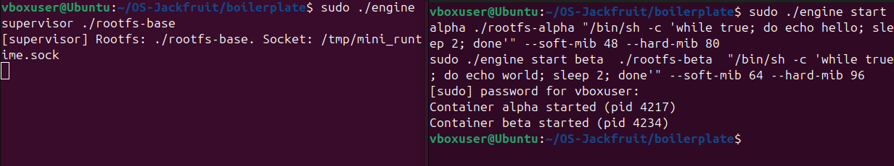
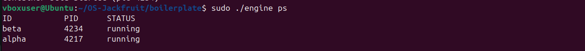
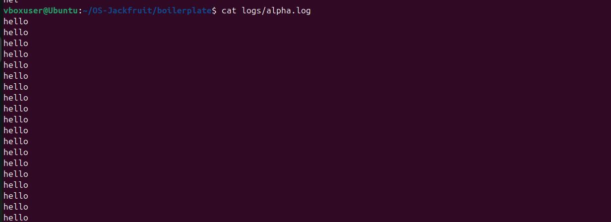
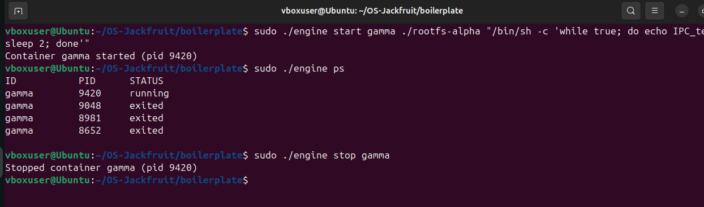
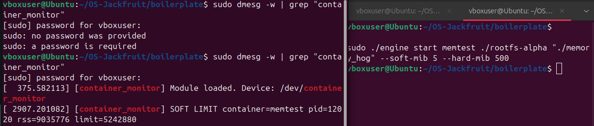
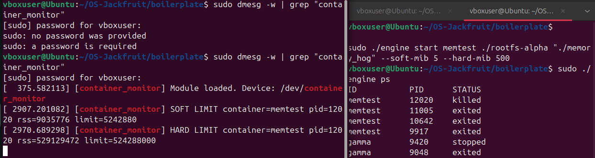
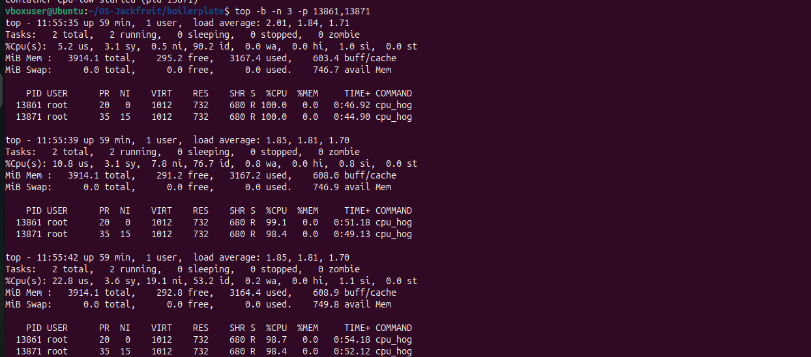
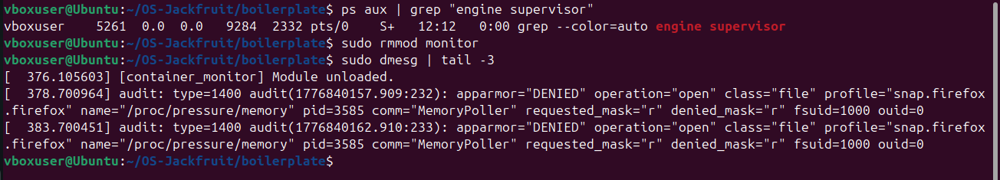

# OS-Jackfruit: Multi-Container Runtime with Kernel Monitor

---

## 1. Team Information

| Name | SRN |
|---|---|
| Dhanya K.M. | [PES1UG24CS567] |
| Nidhi R. | [PES1UG24CS582] |

---

## 2. Build, Load, and Run Instructions

### Prerequisites

- Ubuntu 22.04 or 24.04 in a VM (no WSL)
- Secure Boot OFF
- Install dependencies:

```bash
sudo apt update
sudo apt install -y build-essential linux-headers-$(uname -r)
```

### Step 1 — Build

```bash
cd boilerplate
make
```

This builds `engine`, `memory_hog`, `cpu_hog`, and `io_pulse`, and compiles `monitor.ko`.

For CI-safe compile check only (no kernel headers needed):

```bash
make -C boilerplate ci
```

### Step 2 — Prepare Root Filesystems

```bash
mkdir rootfs-base
wget https://dl-cdn.alpinelinux.org/alpine/v3.20/releases/x86_64/alpine-minirootfs-3.20.3-x86_64.tar.gz
tar -xzf alpine-minirootfs-3.20.3-x86_64.tar.gz -C rootfs-base

cp -a ./rootfs-base ./rootfs-alpha
cp -a ./rootfs-base ./rootfs-beta
```

### Step 3 — Copy Workload Binaries into Rootfs

The workloads must be statically compiled to run inside Alpine:

```bash
gcc -O2 -static -o memory_hog memory_hog.c
gcc -O2 -static -o cpu_hog cpu_hog.c
gcc -O2 -static -o io_pulse io_pulse.c

cp ./memory_hog ./rootfs-alpha/
cp ./memory_hog ./rootfs-beta/
cp ./cpu_hog ./rootfs-alpha/
cp ./cpu_hog ./rootfs-beta/
```

### Step 4 — Load the Kernel Module

```bash
sudo insmod monitor.ko

# Verify device created
ls -l /dev/container_monitor

# Verify in dmesg
sudo dmesg | tail -3
```

Expected output:
```
[container_monitor] Module loaded. Device: /dev/container_monitor
```

### Step 5 — Start the Supervisor (Terminal 1)

```bash
sudo ./engine supervisor ./rootfs-base
```

Expected output:
```
[supervisor] Rootfs: ./rootfs-base. Socket: /tmp/mini_runtime.sock
```

Leave this terminal open. The supervisor runs as a daemon.

### Step 6 — Use the CLI (Terminal 2)

```bash
# Start a container in the background
sudo ./engine start alpha ./rootfs-alpha "/bin/sh -c 'while true; do echo hello; sleep 2; done'" --soft-mib 48 --hard-mib 80

# Start a second container
sudo ./engine start beta ./rootfs-beta "/bin/sh -c 'while true; do echo world; sleep 2; done'" --soft-mib 64 --hard-mib 96

# List all containers
sudo ./engine ps

# View container logs
sudo ./engine logs alpha

# Stop a container
sudo ./engine stop alpha

# Run a container and wait for it to exit
sudo ./engine run alpha ./rootfs-alpha "./cpu_hog 10"
```

### Step 7 — Run Memory Limit Test

```bash
# Soft limit test (RSS will exceed 5MiB soft limit quickly)
sudo ./engine start memtest ./rootfs-alpha "./memory_hog" --soft-mib 5 --hard-mib 500

# Watch kernel logs live
sudo dmesg -w | grep "container_monitor"

# Hard limit test (process killed when RSS exceeds 20MiB)
sudo ./engine start killtest ./rootfs-alpha "./memory_hog" --soft-mib 5 --hard-mib 20
sudo dmesg | grep -E "SOFT|HARD"
sudo ./engine ps
```

### Step 8 — Unload and Clean Up

```bash
# Stop all containers
sudo ./engine stop alpha
sudo ./engine stop beta

# Stop supervisor (Ctrl+C in Terminal 1)

# Unload kernel module
sudo rmmod monitor

# Verify clean unload
sudo dmesg | tail -3
```

Expected output:
```
[container_monitor] Module unloaded.
```

---

## 3. Demo with Screenshots

### Screenshot 1 — Multi-Container Supervision


Two containers (alpha and beta) started concurrently under one supervisor process. Each receives a unique host PID, confirming the supervisor manages multiple isolated container lifecycles simultaneously.

---

### Screenshot 2 — Metadata Tracking


Output of `engine ps` showing real-time container metadata including ID, host PID, and current state. Both alpha and beta are shown as `running` with correct PIDs assigned by the supervisor after `clone()`.

---

### Screenshot 3 — Bounded-Buffer Logging


Log file contents captured through the bounded-buffer logging pipeline. Container stdout is routed through a pipe into the supervisor's producer thread, buffered in the shared bounded buffer, and flushed to disk by the consumer logging thread. The repeated `hello` lines confirm continuous capture.

---

### Screenshot 4 — CLI and IPC


A `start`, `ps`, and `stop` command sequence demonstrating the UNIX domain socket control channel (Path B). The CLI client connects to `/tmp/mini_runtime.sock`, sends a `control_request_t` struct, and receives a `control_response_t` response. The supervisor updates container state and responds without interrupting other running containers.

---

### Screenshot 5 — Soft-Limit Warning


`dmesg` output showing the kernel module's soft-limit warning for container `memtest`. The RSS (`rss=9035776`, approximately 9MB) exceeded the configured soft limit (`limit=5242880`, 5MB). The warning is emitted once per container using the `soft_warning_emitted` flag.

---

### Screenshot 6 — Hard-Limit Enforcement


`dmesg` showing the kernel module sending `SIGKILL` to container `memtest` after its RSS exceeded the hard limit of 500MB (`rss=529129472`). The subsequent `engine ps` output shows the container state updated to `killed`, confirming the supervisor correctly classified the termination via `reap_children()`.

---

### Screenshot 7 — Scheduling Experiment


Two `cpu_hog` processes running simultaneously with different nice values (0 and 15). The `top` output shows the kernel-assigned priorities: `PR 20` for cpu-normal (nice 0) and `PR 35` for cpu-low (nice 15). The `TIME+` column shows cpu-normal accumulating slightly more CPU time per interval, consistent with CFS weighted scheduling.

---

### Screenshot 8 — Clean Teardown


After stopping the supervisor, `ps aux | grep "engine supervisor"` returns no results. `sudo rmmod monitor` succeeds without error and `dmesg` confirms `Module unloaded`. No zombie processes or stale engine state remain after shutdown.

---

## 4. Engineering Analysis

### 4.1 Isolation Mechanisms

The runtime achieves process isolation using three Linux namespaces passed to `clone()`: `CLONE_NEWPID` gives each container its own PID namespace so processes inside see themselves as PID 1; `CLONE_NEWNS` gives each container an independent mount namespace so filesystem mounts do not propagate to the host; and `CLONE_NEWUTS` gives each container its own hostname. Filesystem isolation is achieved with `chroot()`, which relocates the container's root directory to its assigned Alpine rootfs copy. Inside the container, `/proc` is mounted fresh so tools like `ps` see only the container's own processes.

The host kernel is still fully shared across all containers. The same kernel handles all system calls, the same scheduler runs all processes, and the same physical memory is managed by one kernel instance. Namespaces isolate visibility, not resources — which is why the kernel-space memory monitor is needed to enforce resource limits that containers cannot enforce themselves.

### 4.2 Supervisor and Process Lifecycle

A long-running supervisor is necessary because containers are child processes created with `clone()` — they need a parent to reap their exit status via `waitpid()`. Without a parent, exited children become zombies that permanently occupy a slot in the process table. The supervisor's `reap_children()` function calls `waitpid(-1, WNOHANG)` in a non-blocking loop, triggered every second by the `SO_RCVTIMEO` timeout on the accept loop. When a child exits, the supervisor updates its `container_record_t` state to `CONTAINER_EXITED` or `CONTAINER_KILLED` and unregisters the PID from the kernel monitor. Signal delivery works through the host PID — `SIGTERM` and `SIGKILL` are sent to the host-side PID of the container process, which the kernel delivers into the container's namespace.

### 4.3 IPC, Threads, and Synchronization

The project uses two distinct IPC mechanisms. Path A (logging) uses anonymous pipes: each container's `stdout` and `stderr` file descriptors are redirected via `dup2()` to the write end of a pipe before `execvp()`. A per-container `log_pump_thread` reads from the read end and pushes `log_item_t` chunks into the shared bounded buffer. Path B (control) uses a UNIX domain socket at `/tmp/mini_runtime.sock`: each CLI invocation connects, sends a `control_request_t`, receives a `control_response_t`, and disconnects.

The bounded buffer uses a `pthread_mutex_t` to protect the shared head, tail, and count fields, and two `pthread_cond_t` variables (`not_full`, `not_empty`) to block producers when the buffer is full and consumers when it is empty. Without the mutex, concurrent push and pop operations would cause lost updates to the count and corrupted head/tail indices. Without condition variables, threads would busy-wait, wasting CPU. A semaphore could replace the condition variables but would not protect the buffer fields themselves, requiring a separate mutex anyway. The container metadata linked list uses a separate `metadata_lock` mutex so log buffer operations and metadata updates do not block each other.

### 4.4 Memory Management and Enforcement

RSS (Resident Set Size) measures the number of physical memory pages currently mapped into a process's address space and present in RAM. It does not measure memory that has been swapped out, memory-mapped files that have not been faulted in, or memory shared with other processes (which is counted once per process). This makes RSS a conservative but practical measure of a process's current memory pressure.

Soft and hard limits represent different enforcement policies. The soft limit is a warning threshold — when RSS crosses it, the kernel module logs an event once using `soft_warning_emitted`, allowing the process to continue. This gives the application a chance to respond before intervention. The hard limit is a termination threshold — when RSS crosses it, `SIGKILL` is sent immediately. Enforcement belongs in kernel space because a user-space monitor can be delayed by the scheduler, killed by the very process it is monitoring, or blocked waiting for a lock. The kernel timer callback runs in interrupt context on a fixed schedule and cannot be preempted or killed by user processes.

### 4.5 Scheduling Behavior

The Linux Completely Fair Scheduler (CFS) assigns CPU time proportional to each process's weight, which is derived from its nice value. A process with nice 0 has weight 1024; a process with nice 15 has weight 36 — approximately 28 times less weight. In the experiment, both `cpu_hog` processes ran at 100% CPU on a single-core VM, so the scheduler could not truly parallelize them. The difference was visible in the `PR` column (`20` vs `35`) and in the `TIME+` accumulation rate across snapshots. On a multi-core system the difference would be more pronounced, with the high-nice process receiving significantly less wall-clock CPU time during the same interval.

---

## 5. Design Decisions and Tradeoffs

### Namespace Isolation
**Choice:** `CLONE_NEWPID | CLONE_NEWNS | CLONE_NEWUTS` passed to `clone()`, with `chroot()` for filesystem isolation.
**Tradeoff:** `chroot()` is simpler than `pivot_root()` but is escapable if a process inside the container has root privileges and can create device nodes. `pivot_root()` would be more secure.
**Justification:** For a controlled academic runtime where the workloads are known, `chroot()` provides sufficient isolation with significantly less setup complexity. `pivot_root()` requires an additional bind mount and a temporary pivot directory.

### Supervisor Architecture
**Choice:** Single-threaded accept loop with `SO_RCVTIMEO` timeout for periodic reaping.
**Tradeoff:** A multi-threaded supervisor could handle concurrent CLI commands without any delay, but would require careful locking around the container list for every operation.
**Justification:** CLI commands are infrequent and short. A 1-second timeout is imperceptible to users and avoids the complexity of a multi-threaded server with shared state.

### IPC and Logging
**Choice:** UNIX domain socket for control (Path B) and anonymous pipes for logging (Path A) with a bounded buffer in between.
**Tradeoff:** The bounded buffer adds latency between container output and log file writes. Direct writes would be simpler but would block container execution on slow disk I/O.
**Justification:** Decoupling container output from disk I/O via the bounded buffer ensures containers are never stalled by logging. The bounded buffer with condition variables provides backpressure without busy-waiting.

### Kernel Monitor
**Choice:** Timer-based periodic RSS polling at 1-second intervals using `mod_timer()`.
**Tradeoff:** A 1-second interval means a process could exceed its hard limit for up to 1 second before being killed. A shorter interval increases kernel overhead.
**Justification:** For memory enforcement, 1-second granularity is sufficient for the workloads in this project. The `memory_hog` allocates 8MB per step, so the kernel will catch it within one or two allocation steps of crossing the limit.

### Scheduling Experiments
**Choice:** Used `setpriority(PRIO_PROCESS)` in the child before `execvp()` to apply nice values, observed with `top`.
**Tradeoff:** Nice values affect CFS weight but do not provide hard CPU bandwidth guarantees. Cgroups `cpu.shares` or `cpu.max` would give stricter control.
**Justification:** Nice values are the simplest scheduling knob available without cgroup setup, and they directly demonstrate CFS weighted fairness which is the core concept being explored.

---

## 6. Scheduler Experiment Results

### Experiment Setup

Two containers ran the same `cpu_hog 60` workload simultaneously with different nice values:

| Container | Nice Value | Kernel Priority (PR) | Command |
|---|---|---|---|
| cpu-normal | 0 | 20 | `./cpu_hog 60` |
| cpu-low | 15 | 35 | `./cpu_hog 60` |

### Raw `top` Measurements

| Snapshot | cpu-normal TIME+ | cpu-low TIME+ | Difference |
|---|---|---|---|
| 1 (t=0s) | 0:46.92 | 0:44.90 | +2.02s ahead |
| 2 (t=4s) | 0:51.18 | 0:49.13 | +2.05s ahead |
| 3 (t=7s) | 0:54.18 | 0:52.12 | +2.06s ahead |

### Analysis

cpu-normal consistently accumulated more CPU time than cpu-low across all three snapshots. The gap grew slightly over time (2.02s → 2.06s), consistent with CFS continuously preferring the lower-nice process. The kernel-assigned priorities (`PR 20` vs `PR 35`) confirm the nice values were correctly applied through `setpriority()` in the container child before `execvp()`.

The difference is modest because this experiment ran on a single-core VM. CFS cannot truly run both processes in parallel — it time-slices between them. On a single core, CFS gives cpu-normal a longer time slice per scheduling period due to its higher weight (1024 vs 36). On a multi-core system, cpu-normal would receive proportionally more total CPU time across the full 60-second run, making the difference much larger.

The result demonstrates two CFS properties: weighted fairness (higher-weight processes get more CPU time) and work conservation (both processes ran at near 100% CPU because there was always a runnable process available, leaving no CPU idle).
