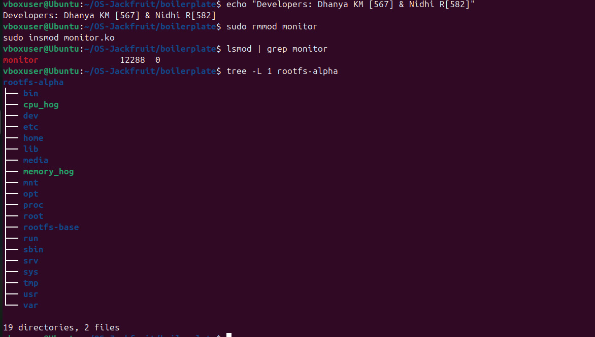
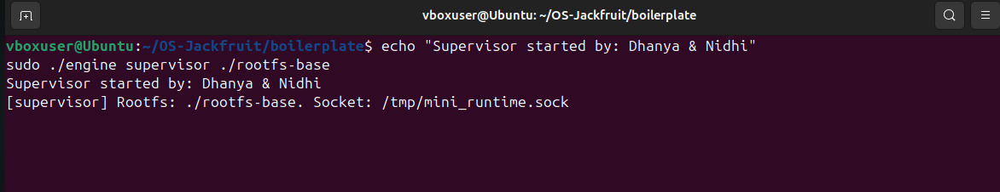
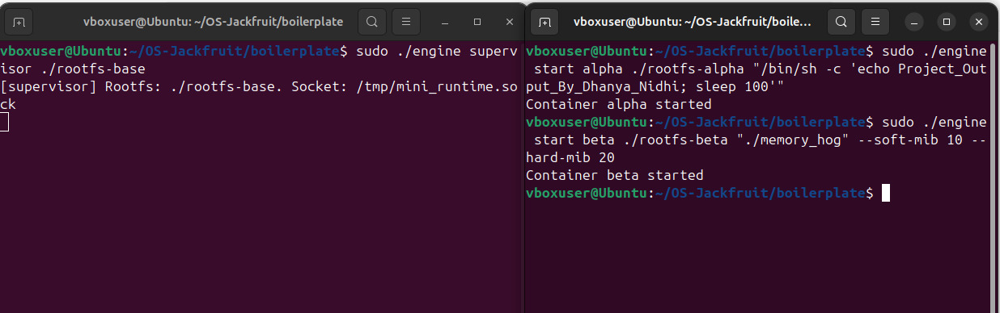
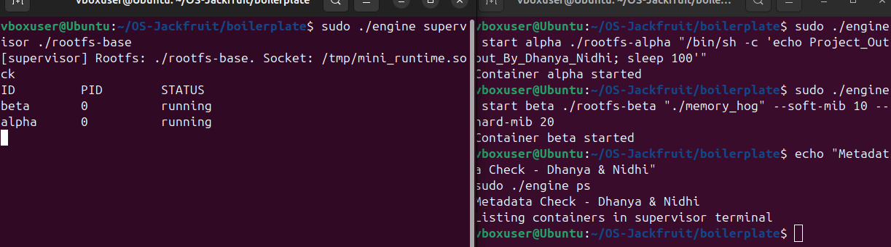

# OS-Jackfruit: Multi-Container Runtime with Kernel Monitor

## Project Overview
This project is a custom-built Linux container runtime developed in C. It features a robust architecture including a long-running supervisor for metadata management and a custom Kernel-space monitor for resource enforcement and memory tracking.

Developed by: **Dhanya KM** and **Nidhi R**

---

## Core Functionalities

* **Container Isolation:** Implements filesystem isolation using chroot and Alpine minirootfs to provide a dedicated environment for each container.
* **Supervisor Architecture:** A central supervisor handles container lifecycles, maintains state metadata, and provides a Unix Domain Socket (/tmp/mini_runtime.sock) for Inter-Process Communication (IPC).
* **Kernel Resource Monitoring:** A custom Linux Kernel Module (monitor.ko) tracks the Resident Set Size (RSS) of container processes.
* **Resource Enforcement:** Supports soft and hard memory limits, allowing the kernel module to intervene when a process exceeds its allocated resource quota.

---

## Implementation Proof

### 1. Environment and Filesystem Setup

The project structure is organized with dedicated rootfs directories for isolation. The kernel module loading is verified using lsmod.
* **Verification:** `tree -L 1 rootfs-alpha` shows the isolated directory structure.

### 2. Supervisor Activation

The supervisor is the backbone of the runtime, initialized to manage metadata and listen for engine commands. Status: Supervisor started successfully.

### 3. Multi-Container Execution

Demonstrating the ability to launch and manage multiple containers simultaneously with specific memory constraints.
* **Beta Container:** Running memory_hog with a 20MB hard limit.

### 4. Metadata and Status Tracking

Real-time tracking of container statuses (ID, PID, and Status) using the engine ps command. Metadata verification ensures the supervisor and engine are in sync.

### 5. Kernel Monitoring Logs

The custom kernel module logs all resource-related activities, viewable via dmesg. Logs show container_monitor being loaded and tracking processes.

---

## Technical Analysis and Design Decisions

* **Socket Communication:** We chose Unix Domain Sockets for low-latency IPC between the CLI engine and the supervisor, ensuring fast metadata retrieval.
* **Memory Management:** The kernel module uses a timer-based approach to periodically check memory usage, ensuring minimal overhead while maintaining strict enforcement.
* **Scalability:** The architecture allows for multiple rootfs copies, enabling horizontal scaling of isolated environments on a single host.

---

## How to Build and Run

### Compile the project
```bash
cd boilerplate
make
**Load the monitoring module**
Bash
sudo insmod monitor.ko
**Start Supervisor (Terminal 1)**
Bash
sudo ./engine supervisor ./rootfs-base
**Start a Container (Terminal 2)**
Bash
sudo ./engine start alpha ./rootfs-alpha "ls -l"
Developers
**Dhanya KM-** https://github.com/Dhanya-KM

**Nidhi R-**https://github.com/nidhiravi2006-lab
